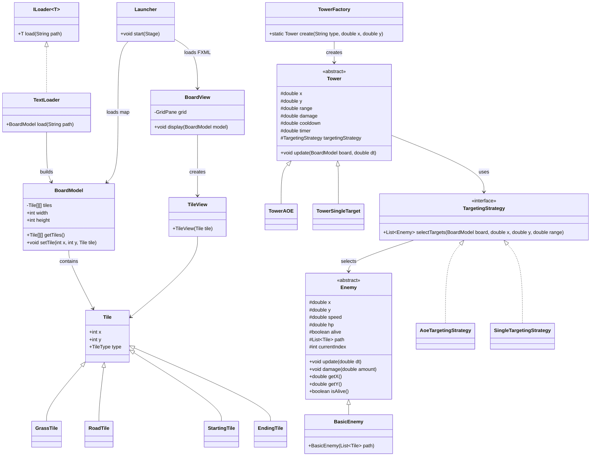

# Tower Defense

```mermaid
classDiagram
    direction TB

%% ======================
%%       MAP / TILES
%% ======================

    class Tile {
        +int x
        +int y
        +TileType type
    }

    class GrassTile
    class RoadTile
    class StartingTile
    class EndingTile

    Tile <|-- GrassTile
    Tile <|-- RoadTile
    Tile <|-- StartingTile
    Tile <|-- EndingTile

    class BoardModel {
        -Tile[][] tiles
        +int width
        +int height
        +Tile[][] getTiles()
        +void setTile(int x, int y, Tile tile)
    }

    class BoardView {
        -GridPane grid
        +void display(BoardModel model)
    }

    BoardModel --> Tile : contains
    BoardView --> TileView : creates


%% ======================
%%          LOADER
%% ======================

    class ILoader~T~ {
        +T load(String path)
    }

    class TextLoader {
        +BoardModel load(String path)
    }

    ILoader <|.. TextLoader
    TextLoader --> BoardModel : builds


%% ======================
%%         TILE VIEWS
%% ======================

    class TileView {
        +TileView(Tile tile)
    }

    TileView --> Tile


%% ======================
%%          ENEMY
%% ======================

    class Enemy {
        #double x
        #double y
        #double speed
        #double hp
        #boolean alive
        #List~Tile~ path
        #int currentIndex
        +void update(double dt)
        +void damage(double amount)
        +double getX()
        +double getY()
        +boolean isAlive()
        <<abstract>>
    }

    class BasicEnemy {
        +BasicEnemy(List~Tile~ path)
    }

    Enemy <|-- BasicEnemy


%% ======================
%%           TOWERS
%% ======================

    class Tower {
        #double x
        #double y
        #double range
        #double damage
        #double cooldown
        #double timer
        #TargetingStrategy targetingStrategy
        +void update(BoardModel board, double dt)
        <<abstract>>
    }

    class TowerAOE
    class TowerSingleTarget

    Tower <|-- TowerAOE
    Tower <|-- TowerSingleTarget

    class TowerFactory {
        +static Tower create(String type, double x, double y)
    }

    TowerFactory --> Tower : creates


%% ======================
%%   TARGETING STRATEGY
%% ======================

    class TargetingStrategy {
        +List~Enemy~ selectTargets(BoardModel board, double x, double y, double range)
        <<interface>>
    }

    class AoeTargetingStrategy
    class SingleTargetingStrategy

    TargetingStrategy <|.. AoeTargetingStrategy
    TargetingStrategy <|.. SingleTargetingStrategy

    Tower --> TargetingStrategy : uses
    TargetingStrategy --> Enemy : selects


%% ======================
%%        LAUNCHER
%% ======================

    class Launcher {
        +void start(Stage)
    }

    Launcher --> BoardView : loads FXML
    Launcher --> BoardModel : loads map
```