# Tower Defense
## 🔎 Overview
A **Tower Defense** game developed in **Java** using **JavaFX**.<br>
The player must defend their base against successive waves of enemies by strategically placing defensive towers on the map.

This project was developed as part of a university course resource titled **"Design Patterns and JavaFX"**, conducted from **November 28, 2025 to January 14, 2026**.

It was created for **educational purposes**, with a strong focus on **software design patterns, clean architecture, object-oriented programming**, and **interactive graphical user interfaces** using JavaFX.

## 🎮 Preview


## ✨ Features
- Drag & drop
- Possibilty to implements multiple tower types with distinct behaviors
- Possibilty to implements multiple enemy types different health & speed
- Random wave system
- Resource management (gold)
- Interactive graphical interface built with JavaFX
- View loading via FXML

## 🛠️ Technologies & Tools Used
- Java 17
- JavaFX
- FXML
- Object-Oriented Programming (OOP)
- Git/GitLab/GitHub
- IDE: IntelliJ

## 🏗️​ Architecture

```mermaid
classDiagram
    direction TB

    %% ---------------- Factory ----------------
    class TileFactory {
        <<utility>>
        + createTileFromChar(c : char, x : int, y : int) : Tile
    }

    %% ---------------- Launch ----------------
    class Launcher {
        + start(stage : Stage) : void
    }

    %% ---------------- Model ----------------
    class Element {
        <<abstract>>
        + Element(x : double, y : double)
        + update() : void
        + getX() : double
        + getY() : double
        + setX(x : double) : void
        + setY(y : double) : void
    }

    class Killable {
        <<abstract>>
        # health : double
        + Killable(x : double, y : double, health : double)
        + takeDamage(damage : double) : void
        + isDead() : boolean
        + getHealth() : double
    }

    class Position {
        # x : double
        # y : double
        + Position(x : double, y : double)
        + getX() : double
        + getY() : double
        + setX(x : double) : void
        + setY(y : double) : void
    }

    class BoardModel {
        - width : int
        - height : int
        - castle : Castle
        - money : int = 200
        - startTime : long
        - elapsedTime : long
        + BoardModel(width : int, height : int, tiles : List~Tile~)
        + createTower(type : String, col : double, row : double) : void
        + getStartingTile() : Tile
        + getValidNeighbors(current : Tile, last : Tile) : List~Tile~
        + addTower(tower : Tower) : void
        + getTowers() : List~Tower~
        + isTowerAt(col : int, row : int) : boolean
        + isGameOver() : boolean
        + addMoney(amount : int) : void
        + spendMoney(amount : int) : boolean
        + updateTimer() : void
        + getFormattedTime() : String
        + getWidth() : double
        + getHeight() : double
        + getTile(x : double, y : double) : Tile
        + addEnemy(enemy : Enemy) : void
        + getEnemies() : List~Enemy~
        + getCastle() : Castle
        + getMoney() : int
    }

    class Castle {
        + Castle(x : double, y : double, health : double)
        + update() : void
    }

    class Enemy {
        <<abstract>>
        # speed : double
        # currentTarget : Tile
        # lastTile : Tile
        + Enemy(x : double, y : double, health : double, speed : double)
        + update(model : BoardModel) : void
        + isAtEnd() : boolean
        + getSpritePath() : String
        + getCurrentTarget() : Tile
        + getLastTile() : Tile
        + getSpeed() : double
        + setLastTile(lastTile : Tile) : void
        + setCurrentTarget(currentTarget : Tile) : void
    }

    class Goblin {
        + Goblin(x : double, y : double)
        + update() : void
        + getSpritePath() : String
    }

    class Projectile {
        <<abstract>>
        # spritePath : String
        # target : Enemy
        # damage : double
        # speed : double = 0.2
        + Projectile(x : double, y : double, target : Enemy, damage : double)
        + update() : void
        + hasHitTarget() : boolean
        + getSpritePath() : String
        + getTarget() : Enemy
        + getDamage() : double
    }

    class Cannonball {
        + Cannonball(x : double, y : double, target : Enemy, damage : double)
        + update() : void
        + getSpritePath() : String
    }

    class Tile {
        <<abstract>>
        + Tile(x : double, y : double)
        + isWalkable() : boolean
        + isBuildable() : boolean
    }

    class StartingTile {
        + StartingTile(x : double, y : double)
        + update() : void
        + isWalkable() : boolean
        + isBuildable() : boolean
    }

    class EndingTile {
        + EndingTile(x : double, y : double)
        + update() : void
        + isWalkable() : boolean
        + isBuildable() : boolean
    }

    class GrassTile {
        + GrassTile(x : double, y : double)
        + update() : void
        + isWalkable() : boolean
        + isBuildable() : boolean
    }

    class RoadTile {
        + RoadTile(x : double, y : double)
        + update() : void
        + isWalkable() : boolean
        + isBuildable() : boolean
    }

    class Tower {
        <<abstract>>
        # name : String
        # description : String
        # spritePath : String
        # damage : double
        # cooldown : double
        # timer : double
        # cost : int
        + Tower(x : double, y : double, damage : double, cooldown : double, cost : int, name : String, description : String, spritePath : String)
        + canAttack() : boolean
        + createAt(x : double, y : double) : Tower
        + resetCooldown() : void
        + update(delta : double) : void
        + getDamage() : double
        + getName() : String
        + getDescription() : String
        + getCost() : int
        + getSpritePath() : String
    }

    class FixedTower {
        + FixedTower(x : double, y : double, damage : double, cooldown : double, cost : int)
        + update() : void
        + createAt(x : double, y : double) : Tower
    }

    class RangingTower {
        + RangingTower(x : double, y : double, damage : double, cooldown : double, cost : int)
        + update() : void
        + createAt(x : double, y : double) : Tower
    }

    class TowerCatalog {
        <<utility>>
        - towerCatalog : Map~String, Tower~
        + getAvailableTowers() : Collection~Tower~
        + getTowerTemplate(id : String) : Tower
    }

    %% ---------------- Logic ----------------
    class Observer {
        <<abstract>>
        # ticks : int
        + update() : void
    }

    class Subject {
        # observers : List~Observer~
        + attach(obs : Observer) : void
        + detach(obs : Observer) : void
    }

    class Ticker {
        - running : boolean
        + attach(o : Observer) : void
        + stop() : void
        + run() : void
    }

    class Spawner {
        - enemiesWaitingToSpawn : int
        - spawnInterval : int
        - random : Random
        + Spawner(board : Board, model : BoardModel)
        + update() : void
        - spawnOneEnemy() : void
    }

    class ProjectileManager {
        - projectiles : List~Projectile~
        + addProjectile(p : Projectile) : void
        + update() : void
        + getProjectiles() : List~Projectile~
    }

    class MovementManager {
        - model : BoardModel
        - random : Random
        + MovementManager(model : BoardModel)
        + update() : void
    }

    class CollisionManager {
        - model : BoardModel
        - ticker : Ticker
        - onGameOver : Runnable
        + CollisionManager(model : BoardModel, ticker : Ticker, onGameOver : Runnable)
        + update() : void
        + checkCollisions() : void
    }

    class AttackManager {
        - model : BoardModel
        - projectileManager : ProjectileManager
        + AttackManager(model : BoardModel, pm : ProjectileManager)
        + update() : void
    }

    class ILoader~T~ {
        <<interface>>
        + load(path : String) : T
    }

    class TextLoader {
        + load(path : String) : BoardModel
    }

    %% ---------------- Views ----------------
    class TileView {
        + TileView(tile : Tile)
    }

    class ProjectileView {
        - projectile : Projectile
        - image : ImageView
        + ProjectileView(projectile : Projectile)
        + update() : void
    }

    class EnemyView {
        - enemy : Enemy
        - imageView : ImageView
        + EnemyView(enemy : Enemy)
        + update() : void
    }

    class CastleView {
        + CastleView(castle : Castle, cellSize : double)
    }

    class Board {
        - board : StackPane
        - grid : GridPane
        - entityPane : Pane
        - projectileManager : ProjectileManager
        - model : BoardModel
        + setModel(model : BoardModel)
        + setProjectileManager(pm : ProjectileManager)
        + display(model : BoardModel)
        + updateView()
    }

    class GameWindowController {
        - boardViewController : Board
        - infoViewController : InfoViewController
        - gameOverOverlay : VBox
        - gameOverTimeLabel : Label
        - model : BoardModel
        - ticker : Ticker
        + initGame() : void
        + restartGame() : void
    }

    class ShopViewController {
        - towerListView : ListView~Tower~
        + initialize() : void
    }

    class InfoViewController {
        - moneyLabel : Label
        - timerLabel : Label
        - money : IntegerProperty
        - time : StringProperty
        + initialize() : void
        + updateInfo(model : BoardModel) : void
    }

    class ImageResource {
        + getImage(path : String) : Image
    }

    %% ---------------- Héritage ----------------
    Tile <|-- StartingTile
    Tile <|-- EndingTile
    Tile <|-- GrassTile
    Tile <|-- RoadTile

    Tower <|-- FixedTower
    Tower <|-- RangingTower

    Enemy <|-- Goblin
    Projectile <|-- Cannonball

    Element <|-- Killable
    Element <|-- Tower
    Element <|-- Tile
    Element --> Position : # position

    Observer <|-- Spawner
    Observer <|-- Ticker
    Observer <|-- ProjectileManager
    Observer <|-- MovementManager
    Observer <|-- CollisionManager
    Observer <|-- AttackManager
    Subject <|-- BoardModel

    BoardModel --> Tower : *towers
    BoardModel --> Enemy : *enemies
    BoardModel --> Tile : grid[][]
    BoardModel --> Castle

    TowerCatalog --> Tower
    Spawner --> Board
    Spawner --> BoardModel
    Spawner --> Enemy
    Spawner --> Tile

    MovementManager --> Enemy
    MovementManager --> BoardModel
    MovementManager --> Tile

    CollisionManager --> BoardModel
    CollisionManager --> Ticker

    AttackManager --> BoardModel
    AttackManager --> Tower
    AttackManager --> ProjectileManager
    AttackManager --> Enemy

    TileFactory --> Tile
    TextLoader --> BoardModel
    TextLoader --> TileFactory
    TextLoader --> Tile

    TileView --> Tile
    ProjectileView --> Projectile
    EnemyView --> Enemy
    CastleView --> Castle
    Board --> TileView
    Board --> EnemyView
    Board --> ProjectileView
    Board --> CastleView
    Board --> Tower
    Board --> BoardModel
    Board --> ImageResource
    GameWindowController --> Board
    GameWindowController --> InfoViewController
    GameWindowController --> Ticker
    GameWindowController --> BoardModel
    GameWindowController --> TextLoader
    GameWindowController --> CollisionManager
    GameWindowController --> MovementManager
    GameWindowController --> ProjectileManager
    GameWindowController --> AttackManager
    GameWindowController --> Spawner
    ShopViewController --> TowerCatalog
    InfoViewController --> BoardModel
    ProjectileView --> ImageResource
    EnemyView --> ImageResource
    CastleView --> ImageResource
```


## 🚀 Installation & Run
> [!IMPORTANT]
> #### Requirements
> - Java 17 or newer
> - JavaFX properly configured
> - Recommended IDE: IntelliJ IDEA or Eclipse

### Run the project
> [!NOTE]
> Fork the project

```
git clone https://github.com/your-username/TowerDefense.git
cd TowerDefense
```

## 👤 Author
 [**Gabriel COUDEL-KOUMBA (Phantom-Whisper)**](https://github.com/Phantom-Whisper)
